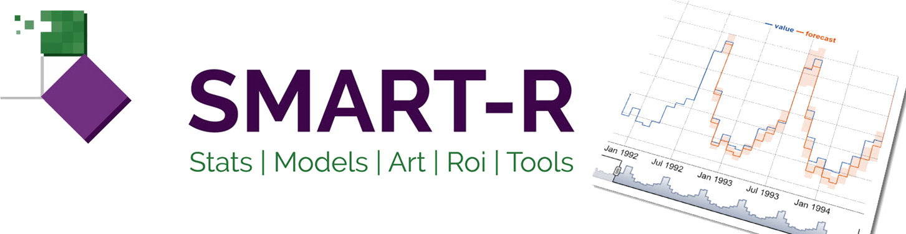

<!-- README.md is generated from README.Rmd. Please edit that file -->

```{r, echo = FALSE}
knitr::opts_chunk$set(
  collapse = TRUE,
  comment = "#>",
  fig.path = "man/figures/",
  out.width = "100%"
)
```

# smart-R <a href="https://www.smart-r.net" target="_blank" rel="noopener noreferrer"></a>

*Under Development*

<!-- badges: start 
[](https://github.com/tidyverse/ggplot2/actions/workflows/R-CMD-check.yaml)
[](https://codecov.io/gh/Fpadt/sapyr)
[](https://cran.r-project.org/package=sapyr) 
<badges: end -->

## Overview


The goal of JADS is to ...

What is special about using `README.Rmd` instead of just `README.md`? You can include R chunks like so:

```{r cars}
summary(cars)
```

You'll still need to render `README.Rmd` regularly, to keep `README.md` up-to-date. `devtools::build_readme()` is handy for this. You could also use GitHub Actions to re-render `README.Rmd` every time you push. An example workflow can be found here: <https://github.com/r-lib/actions/tree/v1/examples>.

You can also embed plots, for example:

```{r pressure, echo = FALSE}
plot(pressure)
```

In that case, don't forget to commit and push the resulting figure files, so they display on GitHub.
